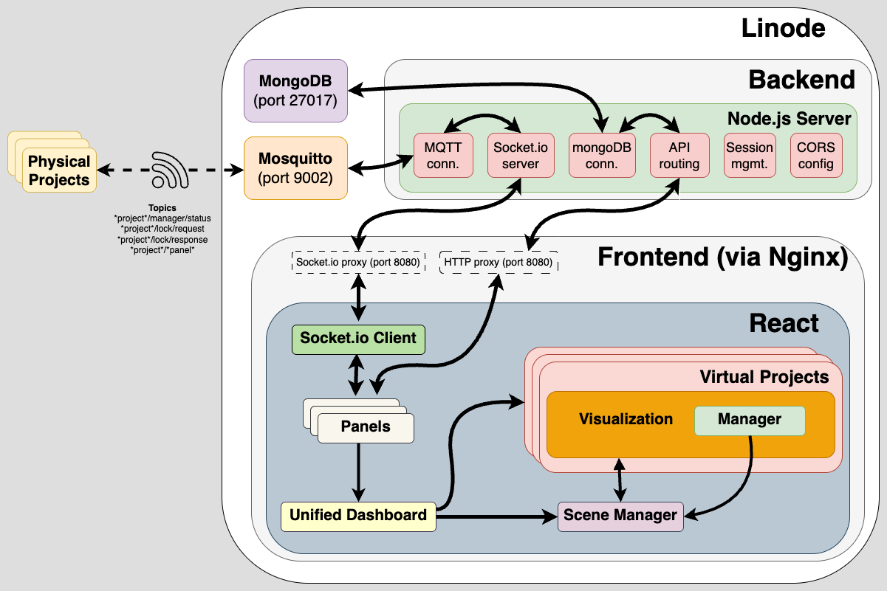

# portfolio
## overview
[chaelchia.com](https://chaelchia.com) is a React app showcasing a spread of the projects I've built over the last few months. I initially set out to build a locally hosted GUI to control the hardware for bring-up and debugging of these projects, but after further consideration, I transitioned the application to serve as a virtual public viewing space and general control center. Each of the devices shown in the portfolio lives in my apartment's shared living space and are available to use.

#### website demo

## motivation
Having designed and built hardware projects in the past, I’ve struggled with displaying completed pieces through well-curated photo and video. My only recording device is my iPhone 12 mini which leaves much to be desired in terms of content quality. It’s also not in my style to prop up a camera for every step of a design + build process, so I was left to explore other ways to share my work.

Regardless of the final visual medium, I decided a website is the most efficient vessel to share one’s work, so it made sense to start there. I hadn’t brought up a website from scratch before but endeavored into the world of frontend development to see what it offered. Pretty quickly I took inspiration from a couple of the highlighted projects on the [Threejs.org](https://threejs.org) homepage. After some experimentation, the resulting website is a virtual environment that allows a user to both see the project designs as they were CADed to be built, and interact with them as they are intended to in their physical presence. 

## design
The frontend is comprised of a few central building blocks:
  - **UnifiedDashboard**: Serves as the ground station for the entire application, managing state and orchestrating interactions between components.
  - **Visualizations**: Each project has a dedicated visualization component that creates its 3D representation in the virtual scene. These components are responsible for
  both visual display and user interaction feedback. Contained within the visualizaiton component is an associated Manager that handles the inputs from the UI, more or less acting as a JS mirror to the python/C++ running on the hardware.
  - **SceneManager**: Provides a shared 3D environment where all project visualizations exist. It handles camera movement, lighting, raycasting for interactions, and post-processing effects.
  - **Panels**: Project-specific panels are the entrances to the user's interaction with the project. These panels vary based on the project's feature sets.
  - **Socket.io Client**: Used for handling MQTT messages forwarded by the backend, and for sending MQTT messages to the backend. Also manages the device locks.

The backend is a lightweight Node.js/Express server that provides endpoints for managing device settings within user "profiles", acting as the bridge between the frontend and the MongoDB documents that store these profiles. It also handles the MQTT connection via a Socket.io server, which forwards messages between the frontend and the MQTT broker.

For now, the website is best viewed on the Safari desktop browser. Chrome and Firefox also work but show some yet-to-be-chased-down discrepancies.

## architecture

## implementation
The application runs on a full-stack infrastructure:
  - The frontend is bundled and served from a **Linode VPS** via **Nginx**. It utilizes **Three.js** for 3D visualization, **TailwindCSS** for styling, and **MQTT.js** for real-time communication.
  - The backend server is running on the same Linode instance, and is proxied by Nginx at the /api endpoint.
  - The Linode is hosting the MQTT broker through **Mosquitto**, which is accessed via a Websocket endpoint proxied by Nginx to allow browser clients to connect securely over WebSockets. Linode is also running MongoDB to store session-specific device settings, client IDs, and state information that persists between sessions.
  - For security, HTTPS is secured via Let's Encrypt certificates, with Nginx handling TLS termination.
